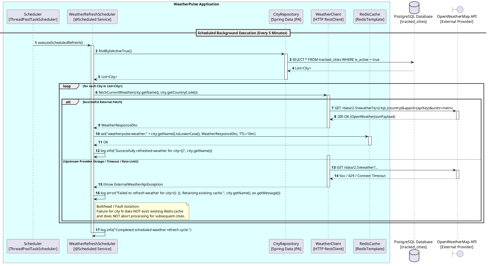
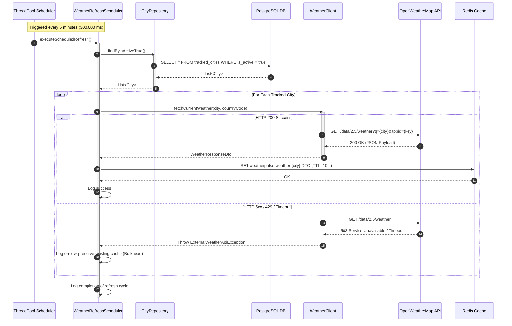
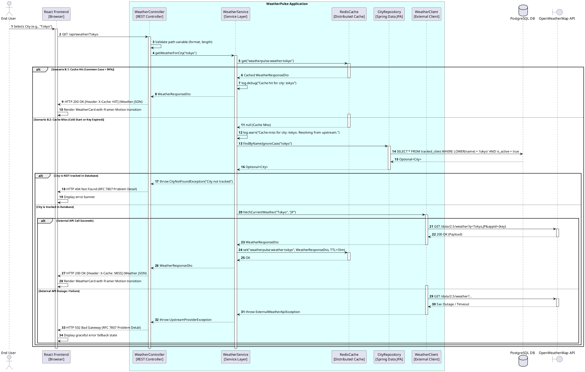
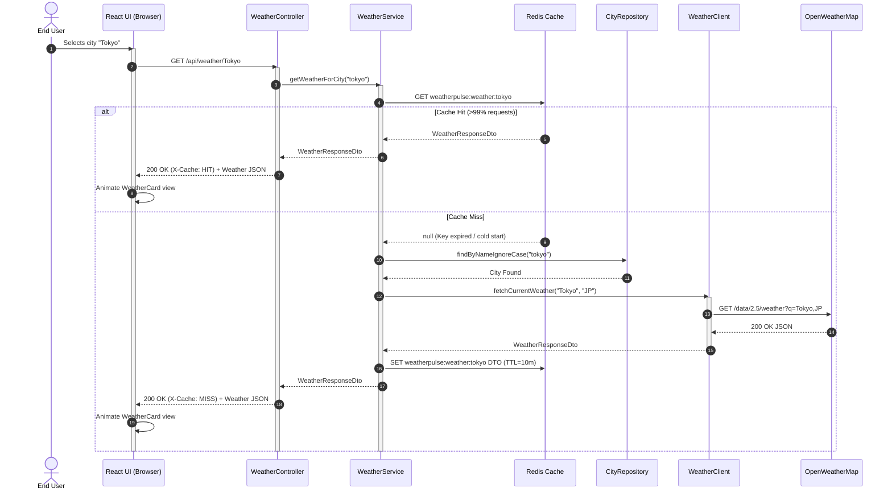
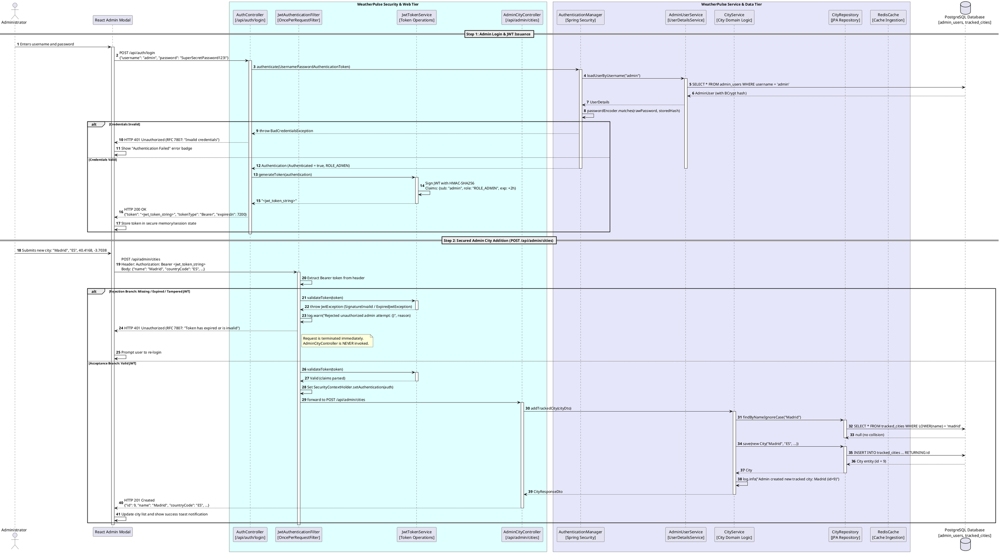
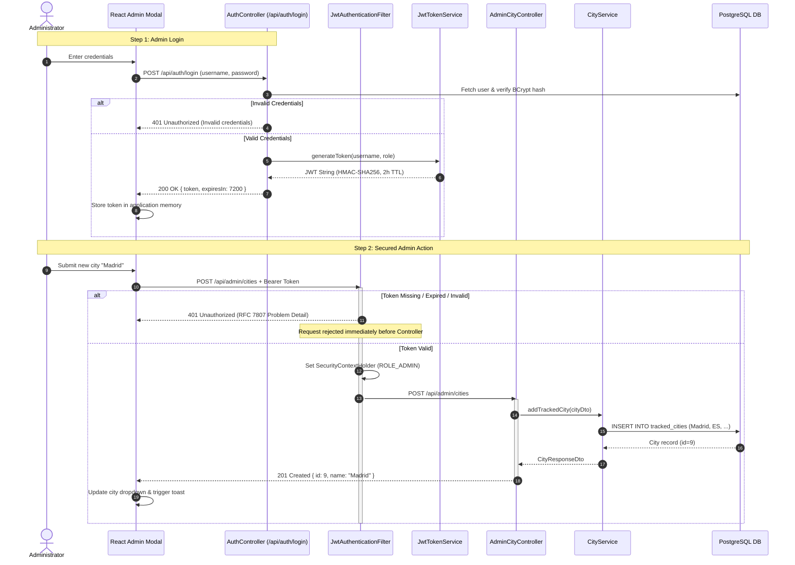

# WeatherPulse Sequence Diagrams (v2)

This document provides runtime interaction sequences for the three core operational flows in WeatherPulse. Both **PlantUML** source (for enterprise architectural rendering) and **Mermaid** diagrams (for immediate IDE and markdown rendering) are provided.

---

## 1. Flow (a): Scheduler-Triggered Proactive Refresh Flow

A dedicated background task (`@Scheduled`) wakes up every 5 minutes, iterates through all active cities in PostgreSQL, retrieves current conditions from OpenWeatherMap, updates Redis with a fresh 10-minute TTL, and isolates errors on a per-city basis without interrupting the loop.

### 1.1 PlantUML Specification

### 1.2 Interactive Mermaid Preview

---

## 2. Flow (b): User-Triggered Reactive Read Flow (Cache-First)

End-users browsing the public React UI trigger read requests. Requests check Redis first. A cache hit returns in <5ms with `X-Cache: HIT`. A cold cache miss validates the city against PostgreSQL, fetches from OpenWeatherMap, updates Redis, and returns with `X-Cache: MISS`.

### 2.1 PlantUML Specification

### 2.2 Interactive Mermaid Preview

---

## 3. Flow (c): Admin Authentication & City Management Flow

This flow illustrates administrative operations: authenticating via `POST /api/auth/login` to obtain a signed JWT, followed by a secured mutation `POST /api/admin/cities` with the `JwtAuthenticationFilter` verifying tokens along both acceptance and rejection execution branches.

### 3.1 PlantUML Specification

### 3.2 Interactive Mermaid Preview

